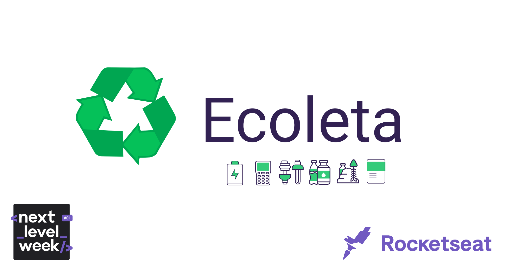
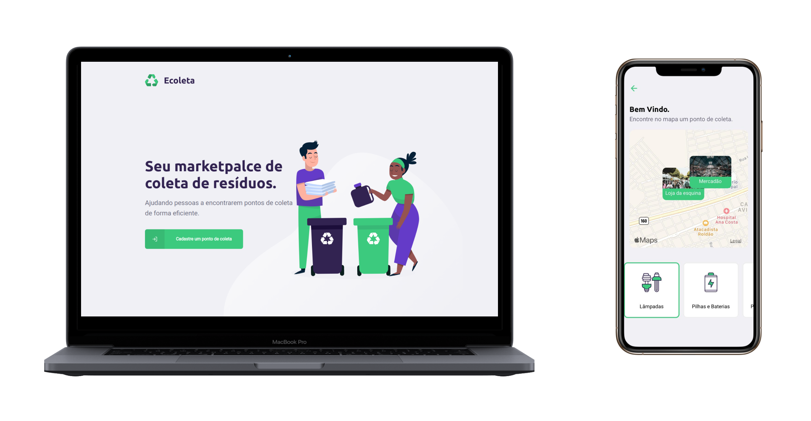

<h1  align="center">

</h1>

<p  align="center">

</p> 

<h4  align="center">
	♻ Ecoleta
</h4>

  
<p  align="center">
<a  href="#telescope-projeto">🔭 Projeto</a>&nbsp;&nbsp;&nbsp;|&nbsp;&nbsp;&nbsp
<a  href="#computer-tecnologias"> 💻 Tecnologias</a>&nbsp;&nbsp;&nbsp;|&nbsp;&nbsp;&nbsp;
<a  href="#-preview">💜 Preview</a>&nbsp;&nbsp;&nbsp;|&nbsp;&nbsp;&nbsp;
<a  href="#-getting-started">🤠 Getting Started </a>
</p>

 

## :telescope: Projeto
 
<b>Ecoleta</b> foi a aplicação desenvolvida durante a Next Level Week, evento realizado pela [Rocketseat](https://rocketseat.com.br/). 
  

## :computer: Tecnologias

**:satellite: API**

- [NodeJs;](https://nodejs.org/en/)

- [TypeScript;](https://www.typescriptlang.org/)

- [Express;](https://www.express.com/)


**:computer: Web**

- [React Js;](https://pt-br.reactjs.org/)

- [TypeScript;](https://www.typescriptlang.org/)

- [Styled-Components;](https://styled-components.com/)

- [Axios.](https://github.com/axios/axios)

**:iphone: Mobile**

- [React Native;](https://facebook.github.io/react-native/)

- [TypeScript;](https://www.typescriptlang.org/)

- [Styled-Components;](https://styled-components.com/)

- [Expo;](https://expo.io/)

- [Axios;](https://github.com/axios/axios)


## 💜 Preview

<p  align="center">
	
</p>

## 🤠 Getting Started

Você precisa clonar o repositório, e pode fazer isso digitando em seu terminal `$ git clone https://github.com/lucaslds94/Ecoleta.git`.
 
### :satellite: API

Logo após clonar o repositório, navegue até a pasta da Api `$ cd api/` e execute o comando `yarn install` ou `npm install`.

Depois de terminar a instalação das dependências, execute o comando `yarn knex:migrate` ou `npm run knex:migrate` para realizar a criação das migrations, e, em sequência, execute `yarn knex:seed` ou `npm run knex:seed` para realizar a criação das seeds.

Logo após seguir tudo que foi feito acima, execute o comando `yarn dev` ou `npm run dev` e deverá aparecer algo parecido com esta mensagem:

```
[SERVER] Server is running on port 3333
```


### :computer: Web

Vá para pasta `$ cd web/` e execute `yarn install` ou `npm install`.

Depois das de terminar de instalar as dependências, execute o comando `yarn start` ou `npm run start`.


### :iphone: Mobile

Vá para pasta `$ cd mobile/` e execute `yarn install` ou `npm install`.

Depois das de terminar de instalar as dependências, execute o comando `yarn start` ou `npm run start`.


--- 

<h5 align="center"> 🚀 Next Level Week - Lucas Lima </h5>

---
